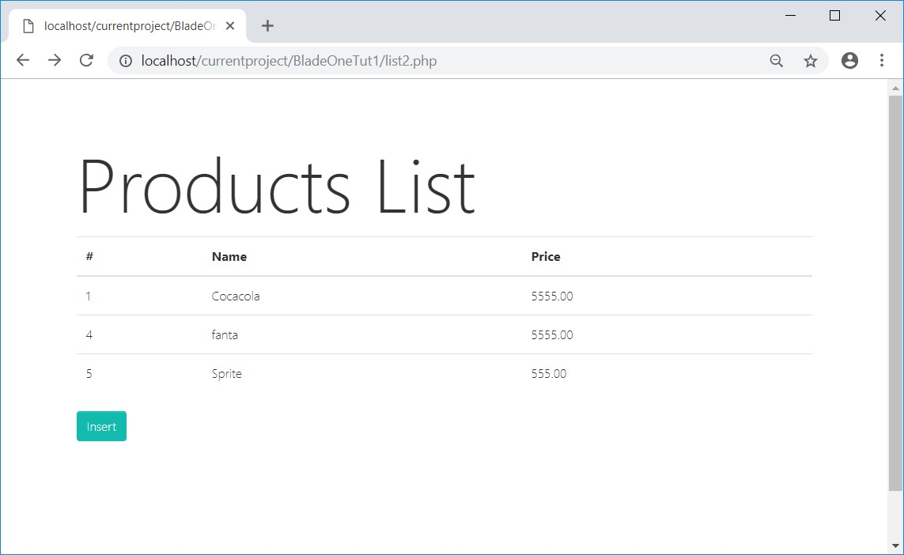
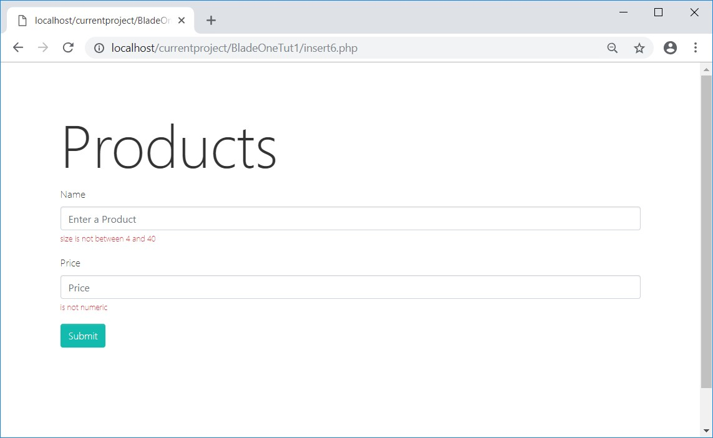

# BladeOne-tutorial1
It is a set of PHP tutorials that includes access to database, templates and validation.

## First tutorial

It is a first tutorial that works the view, database and validation.  
It allows to list and insert a new product in the database.    

[Tutorial Products](tutorialproducts/README.md)