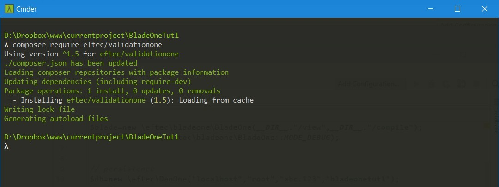

# Tutorial PHP list and insert a products


## Ingredients

* PHP 5.6 or higher must be installed and running with a webserver.
* * You could install a WAMPServer, LAMP or similar.
* PHP's Composer installed and running.
* Knowedge of PHP. It is not a course of PHP
* We use PINGENDO 4 (free) for the design of the page.
* MySQL must be installed.  5.6 or Higher.
* An php editor.  I use PHPStorm (paid application) but it is possible to use any editor.
* An IDE for MYSQL. I use Mysql Workbench (free).
* 45 minutes.

## Stage 1, creating the project.

1. First, let's create a **new folder inside your web folder**. Example c:\wamp\htdocs\

I will use the next folder

> D:\Dropbox\www\currentproject\BladeOneTut1

2. Open the folder with a shell (cmd or terminal) and let's run the next command

So I used the next command to create the folder(windows). Or you could use a GUI to create the folder.

> mkdir D:\Dropbox\www\currentproject\BladeOneTut1

Then,let's go inside the folder 

> cd **folder_name**

and inside it, runs the next command:

> composer init


Then, add the information about your product, for example, your name, stability, package (I used "project"), license (I used "MIT")  

Then, I added the next libraries (interactively, we don't need to indicate the version):
* eftec/bladeone
* eftec/daoone


And that's it, it will create the file composer.json

Then, let's run the next command

> composer udate


It will create the folder vendor and a file called composer.lock

And done (this stage).

## Stage 2 Creating some views

For this part of the project, we will use Pingendo, it is a free aplication to create html using bootstrap 4

### Starting Pingendo

It is the interface of Pingendo: **(we want to create a single page File->New Blank File, not a pingendo project)**


We want to create two pages: a page with a form and with a table.

#### Creating the form with Pingendo
First, let's create the form


I created a form with a title, two fields (name and price) and a submit button.  But let's check if everything is ok.


1. The form must use the method="POST"
2. the first textfield must have a name. I will use "frm_name"
3. the second textfield must have a name. I will use "frm_price"
4. The button must have a name. I will use "frm_button".

And, apparently it's ok.

#### Creating the table
And now, let's create the table with Pingendo (create a new blank page)

It is the initial table


And I changed the header of the table


> Note: We don't need to change the values.

Stage 2, done.

## Stage 3, Template Initial

For the next exercise, we will use the next library:

[BladeOne](https://github.com/eftec/bladeone)

It's already loaded (we loaded with composer)

Let's create a first php file in the root folder of the project.

I will call it **first_tut.php**

```php
<?php
include "vendor/autoload.php"; // it is crap, I will explain it later.

$blade=new \eftec\bladeone\BladeOne(__DIR__."/view",__DIR__."/compile");

echo $blade->run("example.tutorial",[]); // if the page is empty then don't forget the echo
```

So, what it's doing?
1. It's loading an autoload (included by Composer).  It avoids to add "include" manually.  
2. It's create a new instance of the library called BladeOne.  It requires two folders, the **/view** and **/compile**. Folders that we don't have right now.
3. We will run a temmplate (not yet created called **example.tutorial**) and, for data, we will use an empty array.

then, we will run (using the browser) and It will show the next screen:


1. It fails because it doesn't found the template.

So, let's add the template.

Create the next folders **view** and **compile**, so your project should look like this:

* :file_folder: vendor 
* * :page_with_curl: some files...
* * :file_folder: composer 
* * :file_folder: eftec
* :file_folder: view 
* :file_folder: compile
* :page_with_curl: first_tut.php
* :page_with_curl: composer.json
* :page_with_curl: composer.lock

Then, let's modify the code a bit and run it again

```php
<?php
include "vendor/autoload.php"; // it is crap, I will explain it later.

$blade=new \eftec\bladeone\BladeOne(__DIR__."/view",__DIR__."/compile");
// let's add a debug mode so we could know what's going on
$blade->setMode(\eftec\bladeone\BladeOne::MODE_DEBUG);
echo $blade->run("example.tutorial",[]); // if the page is empty then don't forget the echo
```


So, our template must be inside a file called view/example/tutorial.blade.php 

So, let's put it inside.

* :file_folder: vendor 
* * :page_with_curl: some files...
* * :file_folder: composer 
* * :file_folder: eftec
* :file_folder: view 
* * :file_folder: example 
* * * :page_with_curl: **tutorial.blade.php**
* :file_folder: compile
* :page_with_curl: first_tut.php
* :page_with_curl: composer.json
* :page_with_curl: composer.lock

and let's write the next text insie the file **tutorial.blade.php**

```html
hello world
```


> note: I renamed the file as first_tut2.php,, you don't need to do that.

And done.

## Stage 4 Database

### Connecting
Let's open Mysql Workbench 


We could create a new connection or use a previous connection. Pick one.

### Creating a new database (optional)

For to create a new database, we will click on the icon (indicate as 1), then we will put a name of the database, I will use **bladeonetut1** but you could use any name (lowercase). Then, click on the button APPLY (3) and that's it.


### Creating a table

Now, we will create the table called **products**

1. Click on the button (on the image, it's marked as 1).
2. Write the name of the table (2). I will use **products**
3. Then, let's add some columns to the table (4). If for some reason, the columns are not visible, then resize the output window (3) or press the arrow icons (3). We will use the next columns:
3.1 **idproduct** (integer) and Auto Increment (5)
3.2 **name** (varchar(45))
3.2 **price** (decimal(9,2))
4. Finally, click on Apply (6)


### Reading the table

Now, with the table, we could see the information.


>Don't close Workbench, we will use it later.

Stage 4,done.

## Stage 5 Insert Form

We will create a new file in the root folder called **insert.php**

```php
<?php
include "vendor/autoload.php"; // it is crap, I will explain it later.

// view
$blade=new \eftec\bladeone\BladeOne(__DIR__."/view",__DIR__."/compile");
$blade->setMode(\eftec\bladeone\BladeOne::MODE_DEBUG);

// persistence
$db=new \eftec\DaoOne("localhost","root","abc.123","bladeonetut1");
$db->connect();


// this page is two stage:
// stage one, the form is open as new
// stage two, the form was open and somebody clicked on the button

echo $blade->run("product.insert",[]);
```

This page will have two stages, when we open and when we click on the button.
For the database, we will select the correct database. In my case, the database is at **localhost**, the user is **root**, the password is **abc.123** and the database (created in Stage 4) is **bladeonetut1**

We will also create a new template called insert, in the folder product

So, we will create the folder **product** and the file **insert.blade.php**

* :file_folder: vendor 
* * :page_with_curl: some files...
* * :file_folder: composer 
* * :file_folder: eftec
* :file_folder: view 
* * :file_folder: example 
* * * :page_with_curl: tutorial.blade.php
* * :file_folder: **product**
* * * :page_with_curl: **insert.blade.php**
* :file_folder: compile
* :page_with_curl: first_tut.php
* :page_with_curl: **insert.php**
* :page_with_curl: composer.json
* :page_with_curl: composer.lock

Inside **insert.blade.php** we will paste the content of the first page created using Pingendo (stage 2)

And if we run the project, it will show the next screen:


Now, let's integrate all together.
We must add **values** to **insert.blade.php**  

name field:
```html
 <input type="text" class="form-control" placeholder="Enter a Product" name="frm_name" value="{{$product['name']}}">
```                           
price field
```html
<input type="number" name="frm_price" class="form-control" placeholder="Price" value="{{$product['price']}}">
```      
button field
```html
<button type="submit" value="1" name="frm_button" class="btn btn-primary">Submit</button>
```    


And edit **insert.php** as follow.
```php
<?php
include "vendor/autoload.php"; // it is crap, I will explain it later.
include "dao/ProductDao.php";
// view
$blade=new \eftec\bladeone\BladeOne(__DIR__."/view",__DIR__."/compile");
$blade->setMode(\eftec\bladeone\BladeOne::MODE_DEBUG);

// persistence
$db=new \eftec\DaoOne("localhost","root","abc.123","bladeonetut1");
$db->connect();


// this page is two stage:
// stage one, the form is open as new
// stage two, the form was open and somebody clicked on the button

// collecting information
$button=@$_POST['frm_button'];
//$product['idproduct']=null; // it is null because it's auto generated by the database. we don't need it yet.
$product['name']=@$_POST['frm_name'];
$product['price']=@$_POST['frm_price'];

if ($button) {
    // if the button was pressed
    $product['idproduct']=\BladeOneTut1\ProductDao::insert($product);
    $message="ok";
} else {
    // if not, we do nothing special.
    $message="";

}
echo $blade->run("product.insert",['product'=>$product]);
```
So, we are connecting to the database, we are loading a new  class called **ProductDao** and we are collecting the information of button, name and price.
If the button is pressed, then we will call the function insert of **ProductDao**. If not, then we will do nothing.

So, let's create the class ProductDao

### ProductDao

```php
<?php
namespace BladeOneTut1;
class ProductDao
{
    public static function list() {
    }
    public static function insert($product) {
    }
}
```

Right now, this class does nothing but we will be able to run insert. 

* :file_folder: vendor (the folders are close, we don't delete the content)
* :file_folder: view 
* :file_folder: dao 
* * :page_with_curl: **ProductDao.php**
* :file_folder: compile
* :page_with_curl: first_tut.php
* :page_with_curl: **insert.php**
* :page_with_curl: composer.json
* :page_with_curl: composer.lock

If we call the page insert.php and we press the button, it must retains the values of the textfields as follow. But pressing the button doesn't nothing additional


ProductDao.php Mark-2:
```php
<?php
namespace BladeOneTut1;
class ProductDao
{
    public static function list() {
    }
    /**
     * @param $product
     * @return mixed
     * @throws \Exception
     */
    public static function insert($product) {
        global $db; // it is OOP heresy but it works, and fast!. Call it container and we will be OOP friendly ;-)
        return $db->from('products')->set($product)->insert();
    }
}
```

And if we click on the button, it will not show any aditional but it will add a file inside the table.  So let's go back to Workbench, select the table, press on the "icon" indicated to see if the values are in the table.


## Stage 6 List Form

It will be quick.

* :file_folder: vendor (the folders are close, we don't delete the content)
* :file_folder: view 
* * :file_folder: example 
* * :file_folder: product
* * * :page_with_curl: insert.blade.php
* * * :page_with_curl: **list.blade.php**
* :file_folder: dao 
* * :page_with_curl: **ProductDao.php**
* :file_folder: compile
* :page_with_curl: first_tut.php
* :page_with_curl: insert.php
* :page_with_curl: **list.php**
* :page_with_curl: composer.json
* :page_with_curl: composer.lock

### ProductDao.php Mark 3

ProductDao.php Mark-3 and final:
```php
<?php
namespace BladeOneTut1;
class ProductDao
{
    /**
     * @return array|bool
     * @throws \Exception
     */
    public static function list() {
        global $db;
        return $db->select('*')->from('products')->toList();
    }
    /**
     * @param $product
     * @return mixed
     * @throws \Exception
     */
    public static function insert($product) {
        global $db; // it is OOP heresy but it works, and fast!. Call it container and we will be OOP friendly ;-)
        return $db->from('products')->set($product)->insert();
    }
}
```

This class uses the library DaoOne. It is a small wrapper of MysqlI so it's kind useful albeit basic.

> $db->select('*')->from('products')->toList();
This commands generates a new query from **products** (select * from **products**) and returns (as array) the result.
You could run too as  
$db->select('idproduct,name,price')->from('products')->toList();


> $db->from('products')->set($product)->insert();
This commands insert in the table **products** the values stored in $product.  
It works because the array product contains the same name of columns than the  database. 
Otherwise, we should write it as follow
$db->from('products')->set(['name'=>'xxx','price'=>4444])->insert();


### list.blade.php (view)

We will copy the second page generates by Pingendo and we will replace the BODY of the TABLE as follow:

```html
...
<tbody>
@foreach($products as $product)
<tr>
    <td>{{$product['idproduct']}}</td>
    <td>{{$product['name']}}</td>
    <td>{{$product['price']}}</td>
</tr>
@endforeach
</tbody>
...
```            

What is @foreach and {{}} ?. It is part of the specification of BladeOne. It's a tag specifically of the template library.   In this case, it uses the "language" Blade (same as Laravel) that it's simmilar to php.

### list.php (root folder)

```php
<?php
include "vendor/autoload.php"; // it is crap, I will explain it later.
include "dao/ProductDao.php";
// view
$blade=new \eftec\bladeone\BladeOne(__DIR__."/view",__DIR__."/compile");
$blade->setMode(\eftec\bladeone\BladeOne::MODE_DEBUG);

// persistence
$db=new \eftec\DaoOne("localhost","root","abc.123","bladeonetut1");
$db->connect();


// this page is a single stage:
// it loads the list of products
// and it shows on the webpage

$list=\BladeOneTut1\ProductDao::list();

echo $blade->run("product.list1",['products'=>$list]);
```

It's the same than the previous exercise. However, there is not input values. It also loads a list of products from the database. It uses the class ProductDao again.

## Stage 6 Validation

It's here where the things turn nasty.  

What we should validate?

* Security (It is not part of the scope of this tutorial, yet!)
* What will happen if the database is down? or some operation fails?.
* What will happen if the user enters an incorrect name or price?
* What will happen if the user doesn't enter any name or price?.
* What will happen if the operation to the database fails?.

In those cases, **the system must fail gracefully** (it must shows a error message instead of a PHP error)

We will add the next library for validation. **eftec/validationone**

So, let's run the composer (shell) again

> composer require eftec/validationone



Delete the vendor folder and let's run the next command

> composer update


* :file_folder: vendor (the folders are close, we don't delete the content)
* :file_folder: view 
* * :file_folder: example 
* * :file_folder: product
* * * :page_with_curl: **insert.blade.php**
* * * :page_with_curl: **list.blade.php**
* :file_folder: dao 
* :file_folder: compile
* :page_with_curl: first_tut.php
* :page_with_curl: **insert.php**
* :page_with_curl: **list.php**
* :page_with_curl: composer.json
* :page_with_curl: composer.lock

## Validating list

list.php (root)
```php
<?php
include "vendor/autoload.php"; // it is crap, I will explain it later.
include "dao/ProductDao3.php";
// view
$blade=new \eftec\bladeone\BladeOne(__DIR__."/view",__DIR__."/compile");
$blade->setMode(\eftec\bladeone\BladeOne::MODE_DEBUG);
// validation
$val=new \eftec\ValidationOne();
$message="";
// persistence
$db=new \eftec\DaoOne("localhost","root","abc.123","bladeonetut1");
try {
    $db->connect();
} catch (Exception $e) {
    // the end-version mustn't show the $e->getmessage
    $val->addMessage("general","Database is down :".$e->getMessage(),'error');
}
try {

    $list = \BladeOneTut1\ProductDao::list();
} catch (Exception $e) {
    $val->addMessage("general","Unable to get list :".$e->getMessage(),'error');
    $list =array();
}


echo $blade->run("product.list3",['products'=>$list,'messages'=>$val->messageList]);
```

For this casw, we are using the library **ValidationOne**. This library contains two modules: 
* A validation Module **ValidationOne**
* A message List module **MessageList**. The Message List Module is inside validation and it's accesible via field  (**messageList**) but it's also accesible via methods.

Both works in tandem.

In this page, validation is simple, if the operation fails, then we store a message (**general** is a name of a message container).


list.blade.php (view)
After this code (the div "row" that contains the table)
```html
            </tr>
            @endforeach
            </tbody>
        </table>
    </div>
</div> <!-- end of <div class='row'> -->
```

We will add the next code (another row)

```html

<div class="row">
    <div class="col-md-12" >
        <a href="insert6.php" class="btn btn-primary">Insert</a>
    </div>
</div>
@if($messages->errorcount>0)
<div class="row">
    <div class="col-md-12">
        <div class="alert alert-danger" role="alert" > <button type="button" class="close" data-dismiss="alert">×</button>
            <h4 class="alert-heading">Error</h4>
            <p class="mb-0">{{$messages->get('general')->firstErrorOrWarning()}}</p>
        </div>
    </div>
</div>
@endif()
```        

Here, we will use ValidationOne again. If there is an error then we will show the first error or warning contained in the container **general**

If the list fails, then it will show the next message:


## Validating form

```php
<?php
include "vendor/autoload.php"; // it is crap, I will explain it later.
include "dao/ProductDao2.php";
// view
$blade=new \eftec\bladeone\BladeOne(__DIR__."/view",__DIR__."/compile");
$blade->setMode(\eftec\bladeone\BladeOne::MODE_DEBUG);

// validation
$val=new \eftec\ValidationOne();

// persistence
$db=new \eftec\DaoOne("localhost","root","abc.123","bladeonetut1");
try {
    $db->connect();
} catch (Exception $e) {
    $val->addMessage("general","Database is down :".$e->getMessage(),'error');
}


// this page is two stage:
// stage one, the form is open as new
// stage two, the form was open and somebody clicked on the button

// collecting information


$button=$val
    ->type('integer') // it must be a number
    ->def(0) // default value is zero
    ->ifFailThenDefault() // if fails then, the button will be the default value=0
    ->post('frm_button'); // fetch the value
if ($button) {
    $product['name']=$val
        ->type('string') // it could be anything.
        ->required() // required is only if the fetch fails, not if the text is empty or not
        ->condition('betweenlen','',[4,40]) // the length must be between 4 and 40 characters
        ->post('frm_name');
    $product['price']=$val
        ->type('integer') // it must be a number
        ->required() // the field is required (post), again, it's not if the value is zero or not.
        ->condition('between','',[0,10000]) // the value must be between 0 and 10000.
        ->post('frm_price');
    if ($val->messageList->errorcount===0) {
        // we only insert if the number of errors is zero.
        try {
            $product['idproduct'] = \BladeOneTut1\ProductDao::insert($product);
            //we redirect to the list.
            header("location:list2.php");
            die(1);
        } catch (Exception $e) {
            $val->addMessage("general", "Unable to insert the product " . $e->getMessage(), 'error');
        }
    }
} else {
    $product['name']='';
    $product['price']='';
}
echo $blade->run("product.insert4",['product'=>$product,'messages'=>$val->messageList]);
```
So, it is long and it will use ValidationOne again.

First, ValidationOne keeps the error message, it does the basic validations and it also fetch the user input. How handy.

So instead of
```php
$button=$_POST['frm_button']; // fetch the value
```    

we are using:

```php
$button=$val
    ->type('integer') // it must be a number
    ->def(0) // default value is zero
    ->ifFailThenDefault() // if fails then, the button will be the default value=0
    ->post('frm_button'); // fetch the value
```    

In this case, it sets the type of value, it sets a default value, it determines if the operationf ails then $button=0, and it fetchs from the post.

So, we do the same with **frm_name** and **price**

ValidationOne has a list of message called $val->messageList

This list contains the next containers of messages
* general (it just a name that we used)
* frm_button 
* frm_name
* frm_price

So, it is possible to obtain the messages (such as error) for each one of the containers. Or we could obtain all the messages.

So, let's modify the view for use the containers.

insert.blade.php (view)
```php
<div class="row">
    <div class="col-md-12">
        <form class="" method="post" >
            <div class="form-group">
                <label class="">Name</label>
                <input type="text" class="form-control" placeholder="Enter a Product" name="frm_name"
                        value="{{$product['name']}}">
                <small class="text-danger">{{$messages->get('frm_name')->firstError()}}</small>
            </div>
            <div class="form-group">
                <label>Price</label>
                <input type="number" name="frm_price" class="form-control" placeholder="Price" value="{{$product['price']}}">
                <small class="text-danger">{{$messages->get('frm_price')->firstError()}}</small>
            </div>
            <button type="submit" value="1" name="frm_button" class="btn btn-primary">Submit</button>
        </form>
    </div>
</div>
@if($messages->get('general')->countError()>0)
    <div class="row">
        <div class="col-md-12">
            <div class="alert alert-danger" role="alert" > <button type="button" class="close" data-dismiss="alert">×</button>
                <h4 class="alert-heading">Error</h4>
                <p class="mb-0">{{$messages->get('general')->firstErrorOrWarning()}}</p>
            </div>
        </div>
    </div>
@endif()
```

If the operation fails, then it will show the next containers (text in red). It also shows a message if happens a "general" error.


## Disclaimer

## Version

1.0 2018-10-15 First version of the document. It has some typos there and here.

## Copyright

Jorge Castro Castillo [Eftec](https://github.com/eftec/) MIT License.   If you want to copy this document, then go ahead, but you should keep the copyright notice and the link.


